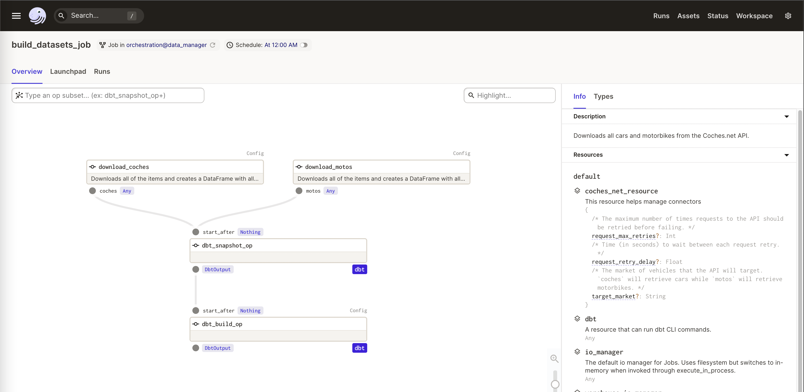
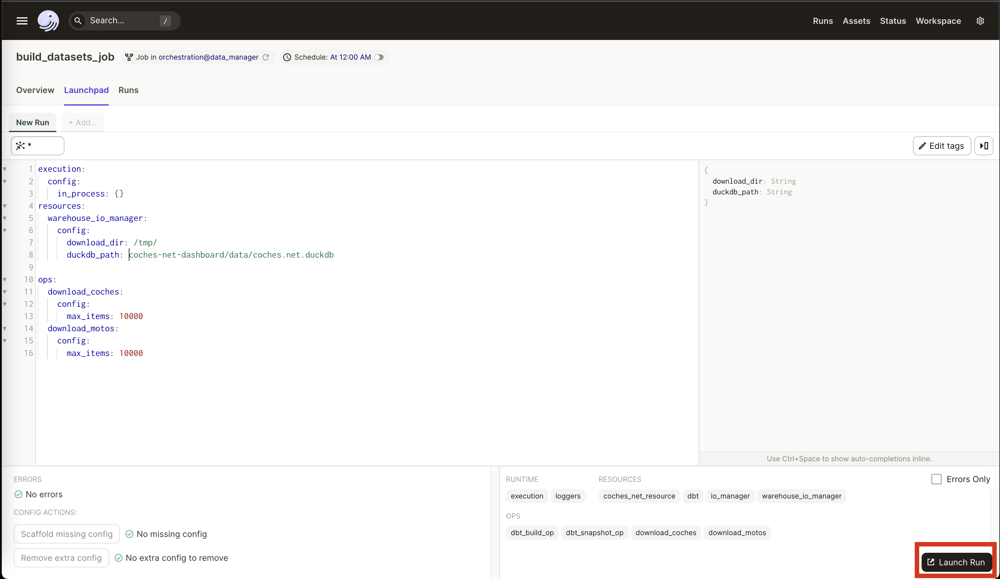
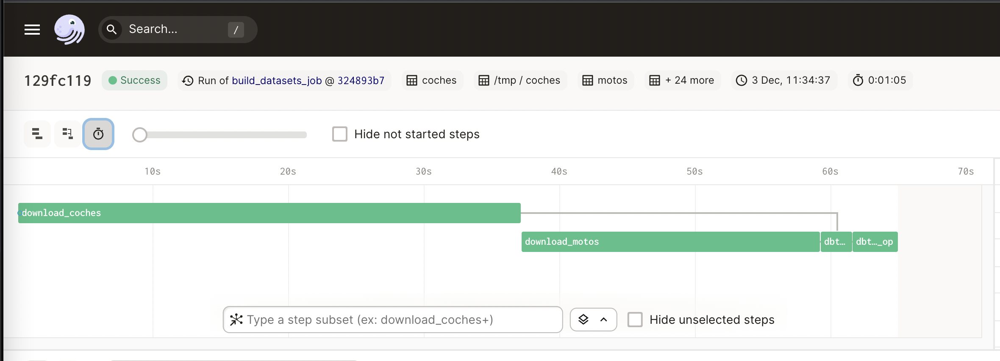
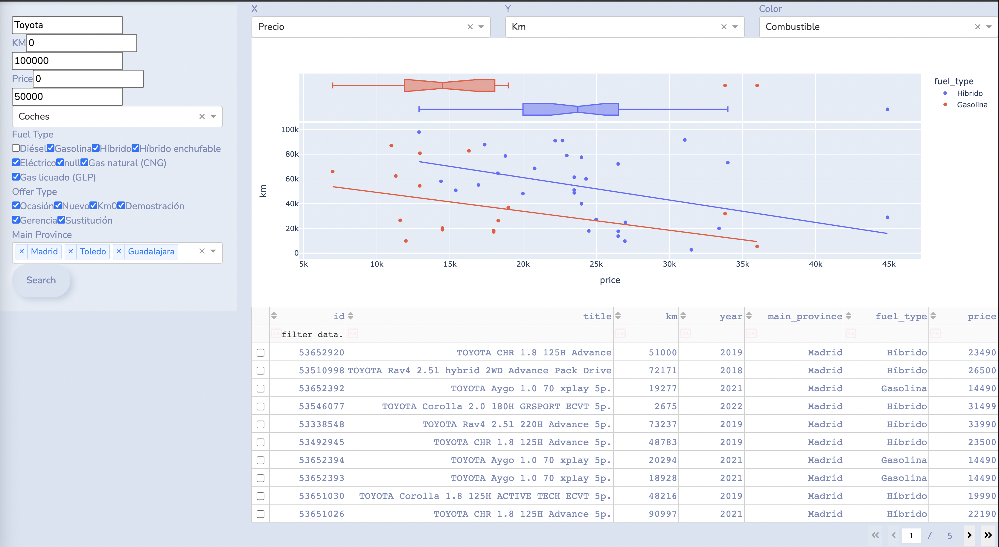

# coches-net-dashboard

Coches.net dashboard is an application made by [@franloza](https://www.github.com/franloza)
and [@Jorjatorz](https://www.github.com/Jorjatorz) to visualize Spanish car and motorcycle market through the data obtained from
the websites [coches.net] and [motos.coches.net](https://motos.coches.net/).

This project is composed of a data pipeline run with [Dagster], which extract data from [coches.net], apply some
transformations using [dbt], and stores the data in a [DuckDB] database. The data can be analyzed with a dashboard
built with [Dash].

This application should not be considered suitable for production, and it's intended to be used only locally for 
analytical purposes.

This project can also serve an example of how to structure an end-to-end data application, ready to be deployed with
a single command using [Docker].

## Quickstart

To run the application simply run

```bash
docker-compose up -d
```

This will build the Docker images (both [Dagster] and [Dash]). The Dagster dashboard is then available on 
http://localhost:3000 and the Dash dashboard in http://localhost:80.

To download the data, go to the [Dagster Dashboard](http://localhost:3000), go to "Launchpad" tab and click "Launch Run".
After all processes have been completed, go to the [Dash Dashboard](http://localhost:80), add some filters and click "Search" to
visualize the data.

The process to download the data can take a while to finish. If you want to limit the amount of data that is downloaded,
you can add the following configuration in the Launchpad:
```yaml
ops:
  download_coches:
    config:
      max_items: <maximum number of cars to download>
  download_motos:
    config:
      max_items: <maximum number of motorcycles to download>
```

## Screenshots






## Local Development (Without using Docker)

### Pre-requirements

You will need to have `pyenv` installed. You can find the installation instructions [here](https://github.com/pyenv/pyenv#installation).

### Orchestration and transformation

1. Create a new Python environment and activate.

```bash
# You can use a different Python version
export PYTHON_VERSION=3.8.14
pyenv install -s $PYTHON_VERSION
pyenv local $PYTHON_VERSION
python -m venv venv
source venv/bin/activate
```

1. Once you have activated your Python environment, install the `orchestration` repository as a Python package. By
using the `--editable` flag, `pip` will install your repository in
["editable mode"](https://pip.pypa.io/en/latest/reference/pip_install/?highlight=editable#editable-installs)
so that as you develop, local code changes will automatically apply.

```bash
pip install -r requirements.txt --editable orchestration 
```

1. Set the `DAGSTER_HOME` environment variable. Dagster will store run history in this directory.

```bash
mkdir ~/dagster_home
export DAGSTER_HOME=~/dagster_home
cat <<EOT >> $DAGSTER_HOME/dagster.yaml
telemetry:
  enabled: false
EOT
```

1. Start the [Dagit process](https://docs.dagster.io/overview/dagit). This will start a Dagit web
server that, by default, is served on http://localhost:3000.
```bash
dagit -w orchestration/workspace.yaml
```

In case you want to debug the ingestion jobs, you can use a helper module named [main.py](orchestration/data_manager/main.py) 
with an entrypoint to be run from IDEs like VSCode or Pycharm.

### Visualization
1. Create a new Python environment and activate.

```bash
cd visualization
deactivate >/dev/null 2>&1 || true
# You can use a different Python version
export PYTHON_VERSION=3.8.14
pyenv install -s $PYTHON_VERSION
pyenv local $PYTHON_VERSION
python -m venv venv
source venv/bin/activate
```

1. Once you have activated your Python environment, install the dependencies using the `requirements.txt` file.
```bash
pip install -r requirements.txt
```

Start the [Gunicorn process](https://docs.gunicorn.org/en/stable/run.html). This will start a [Dash] web
application that will be served on http://localhost:80.
```bash
gunicorn -b 0.0.0.0:80 app:server
```

[Dagster]: https://dagster.io/
[Docker]: https://docs.docker.com/
[Dash]: https://dash.plotly.com/
[coches.net]: https://www.coches.net/
[dbt]: https://docs.getdbt.com/docs/introduction
[DuckDB]: https://duckdb.org/
